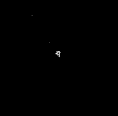
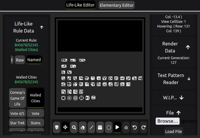
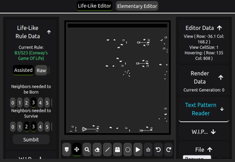
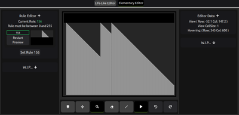

# [Automata](https://cobyj33.github.io/automata)

An online simulation and editor for different Cellular Automata, Currently supports Life-like and Elementary cellular automata

[Visit the Page](https://cobyj33.github.io/automata)

## Help

If there is any immediate fix that I should add, I would love to hear it and will put it in as quickly as I can

## Authors

[@cobyj33](https://www.github.com/cobyj33)

## Version History

### 0.2

Complete visual overhaul, Easier rule manipulation, new generation algorithm.

Still missing many key features like brush size, saving, setting patterns, etc...

### 0.1

Initial Release, supports both life-like and elementary cellular automata but is not the prettiest or most user friendly of ui's and controls
